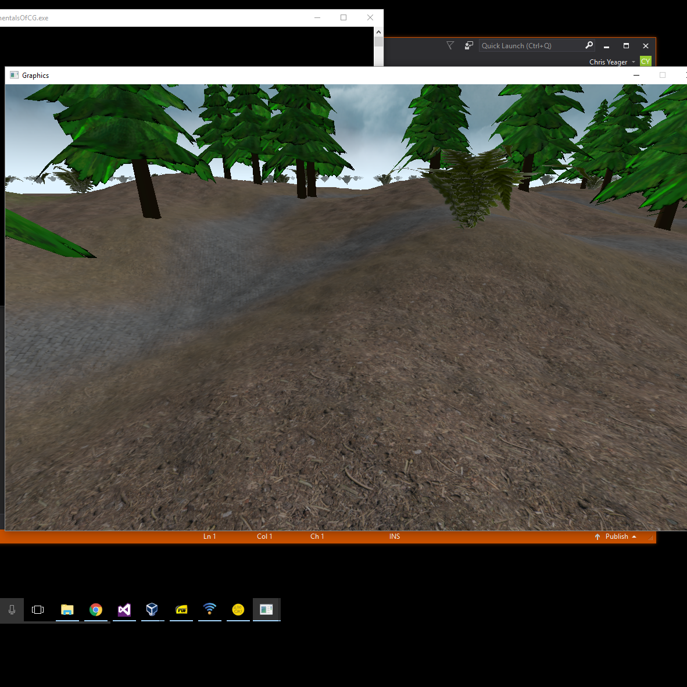
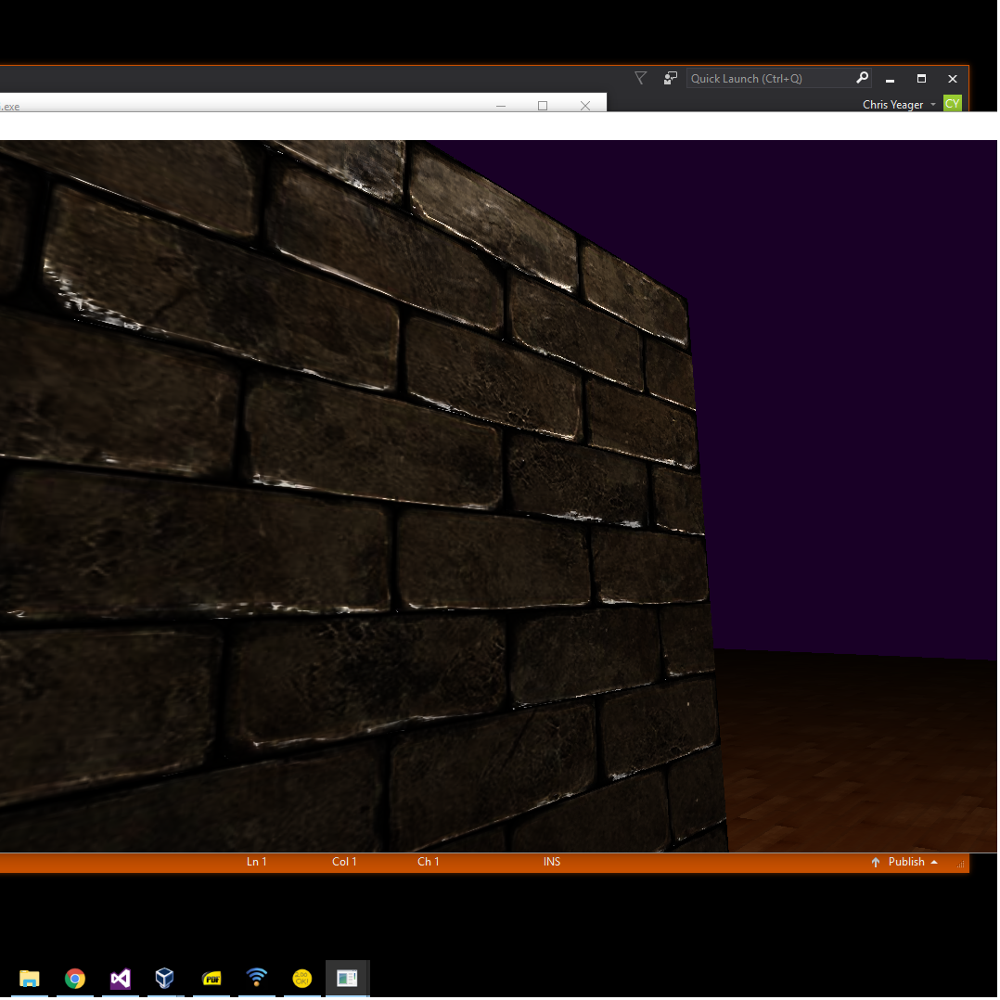
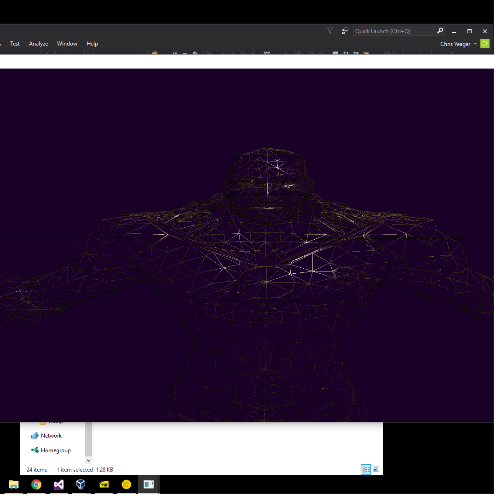

This is a library of code I've been working on in between semesters as I learn more about real-time graphics. It uses the OpenGL
api to interact with the GPU. It also uses SDL to provide a window and user I/O, Asset Importer Library to load 3D models and
Freetype font to render font to the screen.

Some features it currently has are heightmap terrain, multitexturing, normal mapping, and point shadows.

Some of the code is a bit messy especially in main.hpp and main.cpp because this is where I'm constantly testing out new features
and trying to get things to function correctly before I wrap them up into a class.

To learn real-time graphics I read the book Interactive Computer Graphics: A Top-Down Approach by Edward Angel and I watched the
entire lecture series on graphics from UC Davis that is available on YouTube.

Source: <a href="https://github.com//cgyeager/JankyEngine"><i class="large github icon"></i>JankyEngine</a>
