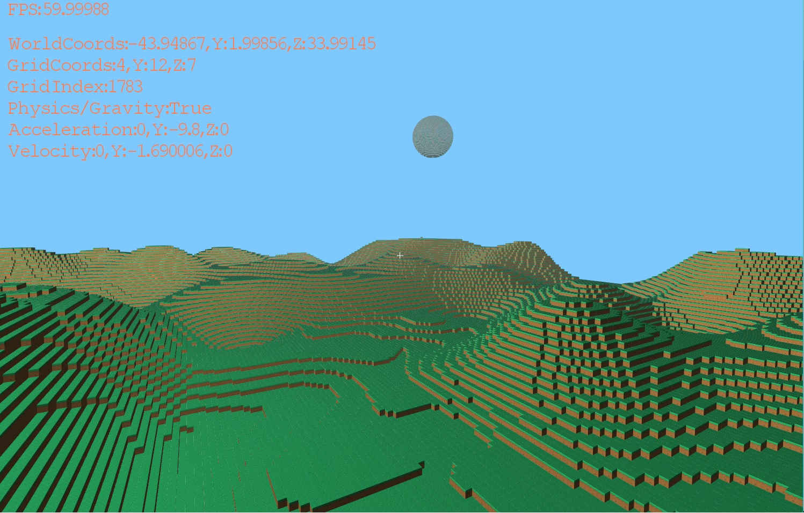
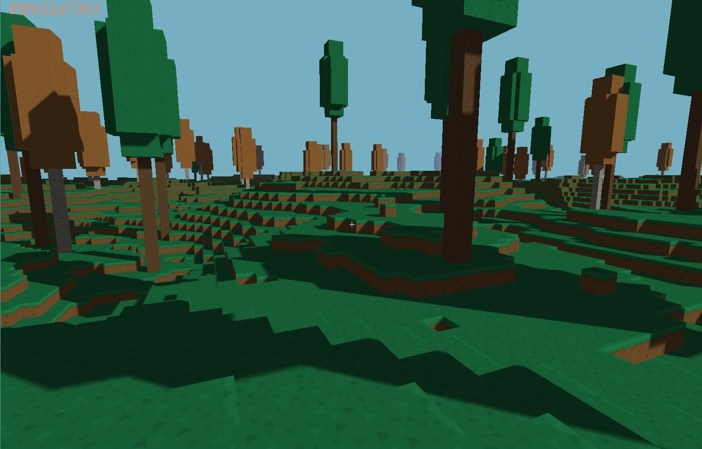
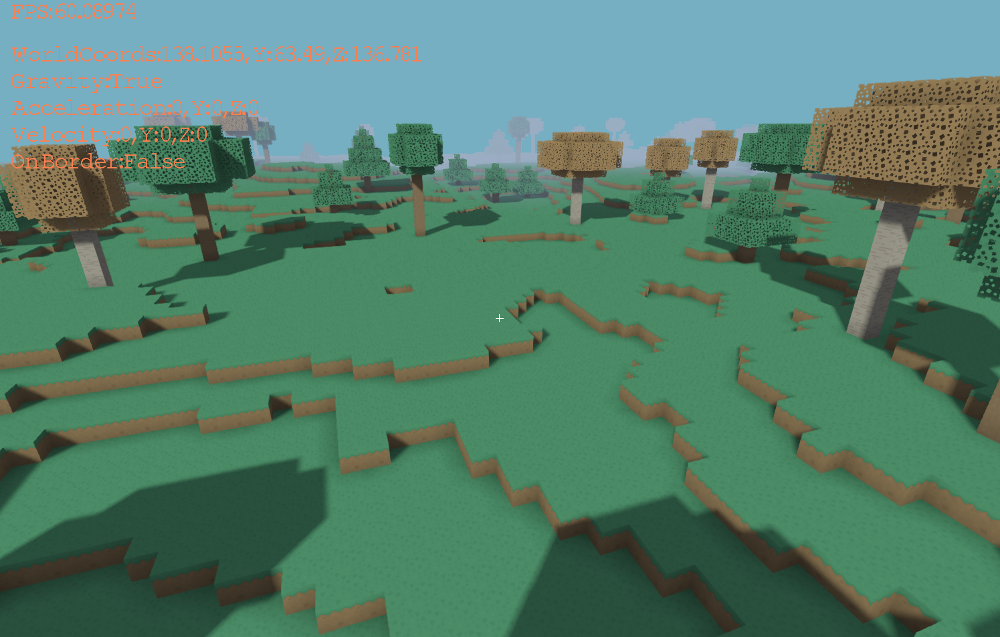

This is a custom game engine built on top of Monogame. It's using custom shaders in HLSL. The purpose of this project
is to learn how voxels work in computer graphics and how to render them as box like meshes (like Minecraft). I'm using 
Monogame so I don't have to deal with any boilerplate code for DirectX and OpenGL. After the main components of the 
engine are finished I will use it to create a simple multiplayer demo game to show off in my portfolio for applying to 
jobs in the games industry. I am no longer updating the source code to github.

Development screenshot after 3 weeks.

Development screenshot after 7 weeks.
Implemented better terrain generation, soft shadows, HDR tone mapping, and bloom

Update: prebaked ambient occlusion, hemispheric lighting, better trees, more occlusion culling

